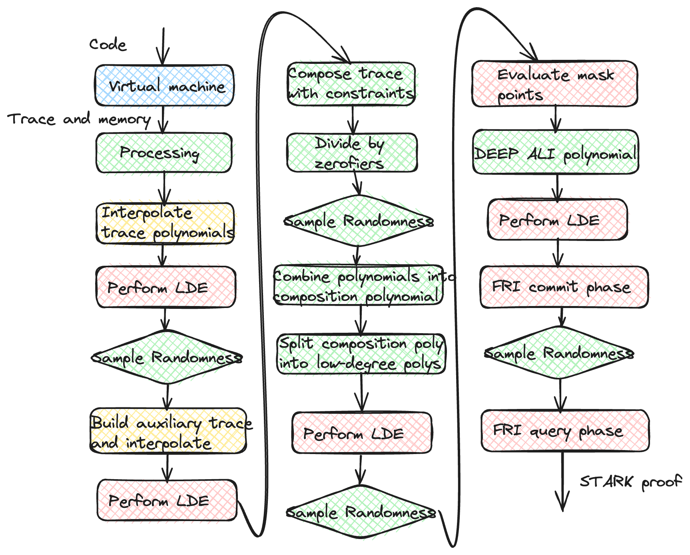

## Introduction

[STARKs](https://eprint.iacr.org/2018/046.pdf) (scalable transparent arguments of knowledge) have gained a lot of attention in recent years due to their capacity to help scale Ethereum and other L1s. They provide a way to guarantee the integrity of a computation carried out by an untrusted party via cryptographic proof. This proof can be verified much faster than the trivial check of the computation, that is, rerunning the whole computation by other parties. The key idea is that the whole computation can be expressed as a table of values and a set of polynomial constraints they must satisfy. This set of constraints can be converted into a random linear combination of quotients of polynomials of the form (we will not go into the details of this transformation. For an intro, see [Stark-101](https://github.com/starkware-industries/stark101) or [our blog](https://blog.lambdaclass.com/diving-deep-fri/))
$$p_0 (x) = \sum_k \alpha_k \frac{c_k (x)}{z_k (x)}$$ 
where $c_k (x)$ and $z_k (x)$ are polynomials. The computation is valid if $p_0 (x)$ is a polynomial (if not, it will be a rational function) and will happen if each $c_k (x)$ is [divisible](https://en.wikipedia.org/wiki/Polynomial_long_division) by its corresponding $z_k (x)$. How can we convince a verifier quickly that the previous $p_0 (x)$ is a polynomial? The key ingredient is the FRI protocol, which we will cover in the following sections. The code presented is taken from the [Stark Platinum Prover](https://github.com/lambdaclass/lambdaworks_stark_platinum/tree/main)

If you want to learn more about the FRI protocol and its properties, we recommend you read [the original STARKs paper](https://eprint.iacr.org/2018/046.pdf) and  [A summary on the FRI low degree test](https://eprint.iacr.org/2022/1216.pdf). We want to thank Eli Ben-Sasson and the amazing Starkware team for helping us learn the protocol and in developing the prover.

## The idea behind FRI

FRI stands for Fast Reed-Solomon Interactive oracle proof of proximity. It allows us to prove that the evaluations of a given function, $p$, over a domain, $D_0$ correspond to the evaluations of a low-degree polynomial (with respect to the size of $D_0$). Why is this useful?

Suppose we want to convince someone that we have some polynomial, $p_0$ of degree $N$. We could pass all the values of the $N+1$ coefficients or $N+1$ evaluations of the polynomial over some set. The problem is that we must pass $N+1$ numbers (in STARKs, the degree $N$ can be large), and the proof and verification will not be short. We could do better by reducing the degree of the polynomial by some suitable transformation. We can split the polynomial into the odd and even degree powers (we will suppose that $N$ is odd, but this doesn't matter),
$p_0 (x) = p_{0,e} ( x^2 ) + x p_{0,o} (x^2 )$
where
$p_{0,e} ( x^2 ) = a_0 + a_2 x^2 + a_4 x^4 + ... + a_{N-1} x^{N-1}$
and 
$p_{0,o} ( x^2 ) = a_1 + a_3 x^2 + a_5 x^4 + ... + a_N x^{N-1}$
we can randomly fold the two parts by getting a random $\beta_0$ and create a polynomial of degree $(N - 1) / 2$,
$p_1 (y) = (a_0 + \beta_0 a_1 ) + (a_2 + \beta_0 a_3 ) y + ... + (a_{N-1} + \beta_0 a_N ) y^{(N - 1)/2}$
We could show that we have a polynomial by passing all the $(N + 1)/2$ coefficients of $p_1 (y)$ and some evaluations of $p_0 (x)$ to show that we deduced correctly $p_1 (y)$ from $p_0 (x)$.

Of course, why would we stop with $(N + 1)/2$ coefficients when we could further reduce the number of coefficients by repeating the same strategy?
$p_1 (y) = p_{1,e} ( y^2 ) + y p_{1,o} (y^2 )$
where
$p_{1,e} ( y^2 ) = b_0 + b_2 y^2 + b_4 y^4 + ... + b_{M} y^{M-1}$
and 
$p_{1,o} ( y^2 ) = b_1 + b_3 y^2 + b_5 y^4 + ... + b_M y^{M-1}$
Then, we sample randomly $\beta_1$ and fold
$p_2 (z) = (b_0 + \beta_1 b_1 ) + (b_2 + \beta_1 b_3 ) z + ... + (b_{M-1} + \beta_1 a_M ) z^{(M - 1)/2}$
We can do this and reduce the degree of the polynomial by half at each step. After the $\log_2 (N)$ steps, we arrive at a constant polynomial and only need to pass that value. We could be convinced that we were given a polynomial if we could go down these foldings and arrive at the last constant value.

Below we give the rust code to fold a polynomial used in Lambdaworks:

```rust= 
pub fn fold_polynomial<F>(
    poly: &Polynomial<FieldElement<F>>,
    beta: &FieldElement<F>,
) -> Polynomial<FieldElement<F>>
where
    F: IsField,
{
    let coef = poly.coefficients();
    let even_coef: Vec<FieldElement<F>> = coef.iter().step_by(2).cloned().collect();

    // odd coefficients of poly are multiplied by beta
    let odd_coef_mul_beta: Vec<FieldElement<F>> = coef
        .iter()
        .skip(1)
        .step_by(2)
        .map(|v| (v.clone()) * beta)
        .collect();

    let (even_poly, odd_poly) = Polynomial::pad_with_zero_coefficients(
        &Polynomial::new(&even_coef),
        &Polynomial::new(&odd_coef_mul_beta),
    );
    even_poly + odd_poly
}
```
The polynomial `poly` is a variable that contains the coefficients of the polynomial as a vector of field elements. We collect the values of even degree coefficients in line 9, and we take all the odd degree coefficients and multiply them by $\beta$ in lines 12 to 17 (we could also make it more efficient by zipping the iterators and avoiding collecting the results and then iterating again over the arrays to add the values).

The problem is that we need to ensure that the polynomials cannot be changed to generate random values. One way to bind us to a polynomial is to build a [Merkle tree](https://en.wikipedia.org/wiki/Merkle_tree) from the evaluations of the polynomial over a suitable domain (this is the part where Reed-Solomon codes come into play). We take a domain $D_0 = \{ \omega, \omega g, \omega g^2 , ... , \omega g^{\alpha N - 1} \}$, where $g$ is a generator of the $\alpha N$ roots of unity and $\omega$ is an element outside the set generated by the powers of $g$. This way, we are forced to provide only values in the tree; the security of this scheme depends on the collision resistance of the hash function used to build the tree. For every folding step, we will have to make a layer containing the values of the evaluations of the polynomial and its corresponding Merkle tree. An advantage of using $D_0$ as a domain is that when we consider the domain $D_1$ for $y = x^2$, its size is exactly half the size of $D_0$. Therefore, the size of the tree for $p_1 (y)$ will be smaller than the size of the one corresponding to $p_0 (x)$ (this is a property of the $n$-th roots of unity, when $n$ is a power of 2. If $x_0$ is in the set, so is $- x_0$ and $x_0^2 = (- x_0)^2 = x_0^2$, so we only have $n/2$ different elements).

FRI is also useful for creating a commitment scheme for polynomials using Merkle trees. If we want to show someone that we have a low degree polynomial $p(x)$ such that $p(z) = v$, we can evaluate the following quotient,
$$q (x) = \frac{p(x) - v}{ x - z}$$
and apply the FRI protocol to that quotient to show that it is indeed a low-degree polynomial.

## Creating FRI layers

As mentioned before, we need to commit ourselves to our polynomial, and we will do that by creating a Merkle tree with the evaluations over a suitable domain. Below we provide a basic structure for a FriLayer: a vector of evaluations and a Merkle tree (we add the coset offset, $\omega$, and domain size just for convenience).

```rust=
#[derive(Clone)]
pub struct FriLayer<F>
where
    F: IsField,
    FieldElement<F>: ByteConversion,
{
    pub evaluation: Vec<FieldElement<F>>,
    pub merkle_tree: FriMerkleTree<F>,
    pub coset_offset: FieldElement<F>,
    pub domain_size: usize,
}

impl<F> FriLayer<F>
where
    F: IsField + IsFFTField,
    FieldElement<F>: ByteConversion,
{
    pub fn new(
        poly: &Polynomial<FieldElement<F>>,
        coset_offset: &FieldElement<F>,
        domain_size: usize,
    ) -> Self {
        let evaluation = poly
            .evaluate_offset_fft(1, Some(domain_size), coset_offset)
            .unwrap(); 

        let merkle_tree = FriMerkleTree::build(&evaluation);

        Self {
            evaluation,
            merkle_tree,
            coset_offset: coset_offset.clone(),
            domain_size,
        }
    }
}
```

We also provide a method to create layers, given a polynomial, the domain size, and the domain offset. This will be combined later with the folding function to create new polynomials and obtain the different layers.

Given the polynomial, we can evaluate it efficiently using FFT (due to the particular structure we are using) and obtain a vector of field elements, as shown in line 23. In line 27, we build the Merkle tree from the vector of evaluations (if you want to learn more on how the Merkle tree works behind the scenes, see [here](https://github.com/lambdaclass/lambdaworks/tree/main/crypto/src/merkle_tree)). In the next section, we will show how to build and commit to all the FRI layers. After this stage, we can prove we committed to a low-degree polynomial.

## FRI commitment phase

Now that we can fold polynomials and build layers, we can commit to every layer and get the first part of the FRI protocol. The commit phase will give us a vector of layers and the final value of the FRI protocol (when we get to a degree zero polynomial). The function needs to receive the number of layers (which can be obtained from the degree of the polynomial), the polynomial in coefficient form, the transcript of the protocol (we will be appending here the roots of the Merkle trees and use this to generate the random challenges by the Fiat-Shamir transformation), the offset and domain size (we could give the domain $D_0$ instead of these last two). The domain size determines the size of the group of roots of unity, and the offset allows us to shift that group.

```rust=
pub fn fri_commit_phase<F: IsField + IsFFTField, T: Transcript>(
    number_layers: usize,
    p_0: Polynomial<FieldElement<F>>,
    transcript: &mut T,
    coset_offset: &FieldElement<F>,
    domain_size: usize,
) -> (FieldElement<F>, Vec<FriLayer<F>>)
where
    FieldElement<F>: ByteConversion,
{
    let mut domain_size = domain_size;

    let mut fri_layer_list = Vec::with_capacity(number_layers);
    let mut current_layer = FriLayer::new(&p_0, coset_offset, domain_size);
    fri_layer_list.push(current_layer.clone());
    let mut current_poly = p_0;
    // >>>> Send commitment: [p₀]
    transcript.append(&current_layer.merkle_tree.root);

    let mut coset_offset = coset_offset.clone();

    for _ in 1..number_layers {
        // <<<< Receive challenge 𝜁ₖ₋₁
        let zeta = transcript_to_field(transcript);
        coset_offset = coset_offset.square();
        domain_size /= 2;

        // Compute layer polynomial and domain
        current_poly = fold_polynomial(&current_poly, &zeta);
        current_layer = FriLayer::new(&current_poly, &coset_offset, domain_size);
        let new_data = &current_layer.merkle_tree.root;
        fri_layer_list.push(current_layer.clone()); // TODO: remove this clone

        // >>>> Send commitment: [pₖ]
        transcript.append(new_data);
    }

    // <<<< Receive challenge: 𝜁ₙ₋₁
    let zeta = transcript_to_field(transcript);

    let last_poly = fold_polynomial(&current_poly, &zeta);

    let last_value = last_poly
        .coefficients()
        .get(0)
        .unwrap_or(&FieldElement::zero())
        .clone();

    // >>>> Send value: pₙ
    transcript.append(&last_value.to_bytes_be());

    (last_value, fri_layer_list)
}
```

We start by creating the layer for the first polynomial (which, in the context of a STARK prover, is the DEEP composition polynomial) at line 14. Then, we commit to the polynomial evaluations using the Merkle tree by appending the root to the transcript (line 18).

Afterward, we continue with the recursive part of FRI: we sample the random coefficient ($\zeta$ in the code, line 24), we square the offset and reduce the domain size (so that we can generate the next evaluation domain), and we fold the polynomial in line 29. We obtain the new layer (line 30), add the root to the transcript (so that we commit to the evaluations of the new polynomial) and add the new layer to the vector of FriLayers. After we have gone through the recursive parts, we fold one last time to arrive at the degree zero polynomial and get the final value, which we also append to the transcript (line 50). 

## FRI decommitment

Now that we created all the commitments, we need to generate the proof so that a verifier can check that everything was done correctly. The only things we can pass to the verifier are values that we committed to by using Merkle trees. Any evaluation in a tree can be calculated from the evaluations inside a tree in the previous layers. We can see that:
$$p_{0,e} (x) = \frac{p_0 (x) + p_0( - x )}{2}$$
and
$$p_{0,o} (x) = \frac{p_0 (x) - p_0( - x )}{2x}$$
Luckily, if $p_0 (x_0)$ is in the Merkle tree, so is $p_0 (- x_0 )$, because of how we chose the domain $D_0$ . We can see then that
$$p_1 ( x_0^2 ) = \frac{p_0 ( x_0 ) + p_0( - x_0 )}{2} + \beta_0 \frac{(p_0 ( x_0 ) - p_0( - x_0 ))}{2x_0}$$
Similarly,
$$p_k ( w_0^2 ) = \frac{p_{k - 1} ( w_0 ) + p_{ k - 1}( - w_0 )}{2} + \beta_0 \frac{(p_{ k - 1 } ( w_0 ) - p_{ k - 1}( - w_0 ))}{2w_0}$$
Therefore, we can check a value in a tree if we pass two values from the tree from the previous layer (these have to be the correct pair, which, owing to the structure of the evaluation domain, are always separated by half the length of the size of the tree).

We will let the verifier choose an index in the Merkle tree of $p_0 (x)$. We will provide the verifier with the values of $p_0 (x_0)$ (where $x_0$ is the point in the domain corresponding to the index chosen by the verifier) and $p_0 (-x_0)$, $p_1 ( x_0^2 )$, $p_1 ( - (x_0^2 ))$, $p_2 ( x_0^4 )$, $p_2 ( - (x_0^4 ))$ until $p_{ N - 1 } ( x_0^{ 2^{ N - 1 }} )$, $p_{ N - 1} ( - (x_0^{ 2^{  N - 1 }} ))$. This way, the verifier can go from the first polynomial to the final value and check that we did everything correctly. We must also show him that the values we passed belong to their correspondent Merkle tree. We will do this by providing him with an inclusion proof, given by the authentication paths for each value. If the inclusion proofs and calculations between the layers pass, the verifier will be convinced that we did things correctly for one point. However, passing the test for one point does not mean that the function is indeed a polynomial because FRI has a statistical nature. Of course, the verifier could choose more points, and if the test passes for all points, the verifier could be convinced with a high probability that the function is indeed a polynomial. We will call each point the verifier chooses a query (the higher the number of queries, the more likely the prover will be caught cheating).

To handle each query better, we will have a FriDecommitment structure containing all the evaluation pairs (`layers_evaluations` and `layers_evaluations_sym`) and authentication paths for each (`layers_auth_paths` and `layers_auth_paths_sym`).

```rust=
pub struct FriDecommitment<F: IsPrimeField> {
    pub layers_auth_paths_sym: Vec<Proof<Commitment>>,
    pub layers_evaluations_sym: Vec<FieldElement<F>>,
    pub layers_auth_paths: Vec<Proof<Commitment>>,
    pub layers_evaluations: Vec<FieldElement<F>>,
}
```

We can now jump onto the query phase of the protocol and obtain the proof for the FRI protocol. Since we want the protocol to be non-interactive, we need the transcript (to simulate the verifier by Fiat-Shamir transformation), all the information from the FriLayers, and other parameters, such as the number of queries (contained here inside the air).

```rust=
pub fn fri_query_phase<F, A, T>(
    air: &A,
    domain_size: usize,
    fri_layers: &Vec<FriLayer<F>>,
    transcript: &mut T,
) -> (Vec<FriDecommitment<F>>, Vec<usize>)
where
    F: IsFFTField,
    A: AIR<Field = F>,
    T: Transcript,
    FieldElement<F>: ByteConversion,
{
    if !fri_layers.is_empty() {
        let number_of_queries = air.options().fri_number_of_queries;
        let iotas = (0..number_of_queries)
            .map(|_| (transcript_to_u32(transcript) as usize) % domain_size)
            .collect::<Vec<usize>>();
        let query_list = iotas
            .iter()
            .map(|iota_s| {
                // <<<< Receive challenge 𝜄ₛ (iota_s)
                let mut layers_auth_paths_sym = vec![];
                let mut layers_evaluations_sym = vec![];
                let mut layers_evaluations = vec![];
                let mut layers_auth_paths = vec![];

                for layer in fri_layers {
                    // symmetric element
                    let index = iota_s % layer.domain_size;
                    let index_sym = (iota_s + layer.domain_size / 2) % layer.domain_size;
                    let evaluation_sym = layer.evaluation[index_sym].clone();
                    let auth_path_sym = layer.merkle_tree.get_proof_by_pos(index_sym).unwrap();
                    let evaluation = layer.evaluation[index].clone();
                    let auth_path = layer.merkle_tree.get_proof_by_pos(index).unwrap();
                    layers_auth_paths_sym.push(auth_path_sym);
                    layers_evaluations_sym.push(evaluation_sym);
                    layers_evaluations.push(evaluation);
                    layers_auth_paths.push(auth_path);
                }

                FriDecommitment {
                    layers_auth_paths_sym,
                    layers_evaluations_sym,
                    layers_evaluations,
                    layers_auth_paths,
                }
            })
            .collect();

        (query_list, iotas)
    } else {
        (vec![], vec![])
    }
}
```

In line 15, we sample all the indexed to open in the Merkle tree belonging to $p_0 (x)$. We normalize by the domain size to ensure the queries fall in the range. Once we get all the indexes to query, we can iterate over them as in line 18 (in this case, we could do it in parallel). For each index, we will go through each FriLayer and get the indexes for $p_k ( u )$ and $p_k ( - u)$ (this is done by taking the remainder between the current index and the domain size for the FriLayer), as in lines 29 and 30, and then take the values of the leaves in the Merkle tree (lines 31 and 33), together with the corresponding authentication paths (lines 32 and 34). We then add each to the vectors containing the evaluations and authentication paths for each query. Finally, we get the complete list of queries and all the necessary values.

## Verification

If a verifier wants to check our work, he needs to perform both the inclusion proofs (to see all values belong to Merkle trees) and that each layer is obtained from the previous one until we reach degree zero. Since the protocol was done non-interactively, the verifier must replay all the random $\beta_k$. We will only focus on the FRI part, but remember that in a general STARK prover, we have more work before that:
```rust=
  let merkle_roots = &proof.fri_layers_merkle_roots;
    let zetas = merkle_roots
        .iter()
        .map(|root| {
            // <<<< Receive commitment: [pₖ] (the first one is [p₀])
            transcript.append(root);

            // >>>> Send challenge 𝜁ₖ
            transcript_to_field(transcript)
        })
        .collect::<Vec<FieldElement<F>>>();

    // <<<< Receive value: pₙ
    transcript.append(&proof.fri_last_value.to_bytes_be());

    // Receive grinding value
    // 1) Receive challenge from the transcript
    let transcript_challenge = transcript.challenge();
    let nonce = proof.nonce;
    let leading_zeros_count =
        hash_transcript_with_int_and_get_leading_zeros(&transcript_challenge, nonce);
    transcript.append(&nonce.to_be_bytes());

    // FRI query phase
    // <<<< Send challenges 𝜄ₛ (iota_s)
    let iota_max: usize = 2_usize.pow(domain.lde_root_order);
    let iotas: Vec<usize> = (0..air.options().fri_number_of_queries)
        .map(|_| (transcript_to_u32(transcript) as usize) % iota_max)
        .collect();
```

The verifier appends to the transcript the roots of each Merkle tree, one at a time, and gets the value for $\beta_k$ (lines 2 to 11). Then, the verifier adds the final value of the FRI protocol (line 14); if there is proof of work, after the verifier has checked that the nonce provided is correct (done before), he adds the nonce to the transcript and samples all the indexes.

With this, the verifier can proceed to check all queries,

```rust=
fn verify_fri<F, A>(
    proof: &StarkProof<F>,
    domain: &Domain<F>,
    challenges: &Challenges<F, A>,
) -> bool
where
    F: IsFFTField,
    FieldElement<F>: ByteConversion,
    A: AIR<Field = F>,
{
    // verify FRI
    let two_inv = &FieldElement::from(2).inv();
    let mut evaluation_point_inverse = challenges
        .iotas
        .iter()
        .map(|iota| &domain.lde_roots_of_unity_coset[*iota])
        .cloned()
        .collect::<Vec<FieldElement<F>>>();
    FieldElement::inplace_batch_inverse(&mut evaluation_point_inverse);
    proof
        .query_list
        .iter()
        .zip(&challenges.iotas)
        .zip(evaluation_point_inverse)
        .fold(true, |mut result, ((proof_s, iota_s), eval)| {
            //This is done in constant time
            result &= verify_query_and_sym_openings(
                proof,
                &challenges.zetas,
                *iota_s,
                proof_s,
                domain,
                eval,
                two_inv,
            );
            result
        })
}
```

In this function, the verifier receives all the FriDecommitment (contained in the StarkProof), the domain $D_0$ (which includes all evaluation points), and the challenges (indexes) sampled by replaying what the prover did. Lines 12 to 19 are just optimizations for performance, where the verifier computes the inverses of the evaluation points in batch (this is to calculate divisions more efficiently). Then, the verifier proceeds to check each query. The function `verify_query_and_sym_openings` has the following code:

```rust=
fn verify_query_and_sym_openings<F: IsField + IsFFTField>(
    proof: &StarkProof<F>,
    zetas: &[FieldElement<F>],
    iota: usize,
    fri_decommitment: &FriDecommitment<F>,
    domain: &Domain<F>,
    evaluation_point: FieldElement<F>,
    two_inv: &FieldElement<F>,
) -> bool
where
    FieldElement<F>: ByteConversion,
{
    let fri_layers_merkle_roots = &proof.fri_layers_merkle_roots;
    let evaluation_point_vec: Vec<FieldElement<F>> =
        core::iter::successors(Some(evaluation_point), |evaluation_point| {
            Some(evaluation_point.square())
        })
        .take(fri_layers_merkle_roots.len())
        .collect();

    let mut v = fri_decommitment.layers_evaluations[0].clone();
    // For each fri layer merkle proof check:
    // That each merkle path verifies

    // Sample beta with fiat shamir
    // Compute v = [P_i(z_i) + P_i(-z_i)] / 2 + beta * [P_i(z_i) - P_i(-z_i)] / (2 * z_i)
    // Where P_i is the folded polynomial of the i-th fiat shamir round
    // z_i is obtained from the first z (that was derived through Fiat-Shamir) through a known calculation
    // The calculation is, given the index, index % length_of_evaluation_domain

    // Check that v = P_{i+1}(z_i)

    // For each (merkle_root, merkle_auth_path) / fold
    // With the auth path containing the element that the path proves its existence
    fri_layers_merkle_roots
        .iter()
        .enumerate()
        .zip(&fri_decommitment.layers_auth_paths)
        .zip(&fri_decommitment.layers_evaluations)
        .zip(&fri_decommitment.layers_auth_paths_sym)
        .zip(&fri_decommitment.layers_evaluations_sym)
        .zip(evaluation_point_vec)
        .fold(
            true,
            |result,
             (
                (((((k, merkle_root), auth_path), evaluation), auth_path_sym), evaluation_sym),
                evaluation_point_inv,
            )| {
                let domain_length = 1 << (domain.lde_root_order - k as u32);
                let layer_evaluation_index_sym = (iota + domain_length / 2) % domain_length;
                // Since we always derive the current layer from the previous layer
                // We start with the second one, skipping the first, so the previous layer is the first one
                // This is the current layer's evaluation domain length.
                // We need to know what the decommitment index for the current
                // layer is so we can check the Merkle paths at the right index.

                // Verify opening Open(pₖ(Dₖ), −𝜐ₛ^(2ᵏ))
                let auth_sym = &auth_path_sym.verify::<FriMerkleTreeBackend<F>>(
                    merkle_root,
                    layer_evaluation_index_sym,
                    evaluation_sym,
                );
                // Verify opening Open(pₖ(Dₖ), 𝜐ₛ)
                let auth_point =
                    auth_path.verify::<FriMerkleTreeBackend<F>>(merkle_root, iota, evaluation);
                let beta = &zetas[k];
                // v is the calculated element for the co-linearity check
                v = (&v + evaluation_sym) * two_inv
                    + beta * (&v - evaluation_sym) * two_inv * evaluation_point_inv;

                // Check that the next value is given by the prover
                if k < fri_decommitment.layers_evaluations.len() - 1 {
                    let next_layer_evaluation = &fri_decommitment.layers_evaluations[k + 1];
                    result & (v == *next_layer_evaluation) & auth_point & auth_sym
                } else {
                    result & (v == proof.fri_last_value) & auth_point & auth_sym
                }
            },
        )
}
```

At each step, we have to divide by $x_0^{ 2^{ k } }$, which is the same as multiplying by the (multiplicative) inverse. We previously precomputed $x_0^{ - 1}$, and all the other inverses can be computed by repeatedly squaring that number (lines 14 to 19). Afterward, the verifier can go through all the FriLayers. We will use a fold iterator to have a constant time implementation (lines 35 to 43). If any check is false, then the proof will fail. The verifier samples the indexes for the current layer (line 51). Then, the verifier checks the inclusion proofs for the values (lines 59 and 65). Then, the verifier computes the value for the next layer from the current one (lines 69-70). If we are not in the last layer, the verifier checks whether this computed value is equal to the value given in the decommitment for the next layer (lines 73-75); if this does not pass, the test will fail. If it is the last layer, the verifier compares the computed value with the last value of the FRI protocol. 

## Security

The security of FRI depends on the size of the finite field, the security of the hash function, and the number of queries. Let's dive into each aspect:
1. The finite field size should be much larger than the degree of the polynomial (which in a STARK prover is related to the trace length). To achieve 128 bits of security, the field size should be at least $2^{128}$. If the maximum trace length is $2^{30}$, the field should be at least $2^{158}$. If the base field is not large enough, we can work with extensions when sampling random challenges. Some common choices are the StarkPrime 252, the prime $2^{64} - 2^{32} + 1$ (often miscalled MiniGoldilocks and using degree 3 extension fields), BabyBear or Mersenne 31 ($2^{31} - 1$, using degree 6 extension).
2. The security provided by the hash function should be at least the security level we aim at. For hash functions such as SHA2, SHA3, Blake2, Blake3, and Poseidon, the security is simply the size of the digest (hash) divided by two. Therefore, using digests of 32 bytes (256 bits) achieves the desired security level. If we want to cover ourselves against Grover's algorithm from quantum computers, we need to double the digest size to 64 bytes (512 bits). This increases the size of the proof.
3. The number of queries. Each query provides a certain amount of bits of security, depending on the blowup factor used. The number of queries can be reduced by introducing proof of work into the prover's protocol, incrementing the cost of generating false proofs. There is a tradeoff between the blowup factor used (which increases the prover's work and memory use) and the number of queries (which increases the proof size and verifier's work).

For more discussion into the security of FRI, see [EthSTARK](https://eprint.iacr.org/2021/582), [A summary on FRI low degree testing](https://eprint.iacr.org/2022/1216.pdf), and [Fiat-Shamir security of FRI](https://eprint.iacr.org/2023/1071).

## Summary

FRI is a proximity test that allows us to show that a specific function is close to a low-degree polynomial, which is a helpful tool to build proof systems, such as STARKs or Plonky2. 
In this post, we covered how to code the protocol from scratch (except for the necessary Merkle trees and finite field arithmetic) and how to verify a FRI proof. The protocol consists of randomly folding a polynomial and committing to the evaluations of the polynomial over a suitable domain using Merkle trees until the resulting polynomial has degree zero. To show that the protocol was carried out correctly, the prover must supply evaluations of each polynomial and prove that those values are inside the Merkle tree. The protocol's security relies on the properties of the hash function and depends on the size of the field, the size of the digest, and the number of queries used. 

## Introduction

At LambdaClass, we are building [Lambdaworks](https://github.com/lambdaclass/lambdaworks), a library for developing zero-knowledge stuff. One important proof system is [STARKs](https://eprint.iacr.org/2018/046.pdf) (Scalable, transparent arguments of knowledge). STARKs are a powerful tool that allows us to prove the integrity of a given computation. For an overview of STARKs, you can look at our [previous post](https://blog.lambdaclass.com/lambdaworks-or-how-we-decided-to-created-our-zksnarks-library-and-a-stark-prover/t) or the excellent tutorials by Starkware, such as [STARK-101](https://starkware.co/stark-101/) (for the rust version, you can follow [this link](https://github.com/lambdaclass/STARK101-rs/)) and the posts on [arithmetization I](https://medium.com/starkware/arithmetization-i-15c046390862) and [II](https://medium.com/starkware/arithmetization-ii-403c3b3f4355), and [Anatomy of a STARK](https://aszepieniec.github.io/stark-anatomy/overview).

In this post, we will do a pen-and-paper example of STARKs, so we can follow all the steps needed to generate and validate a proof (we will skip the hashing part, though). One important aspect to point out is that, in this case, we are not interested in the security properties of what we do (but it should really matter in real life). Let's jump into the problem...

## Problem statement

Suppose we want to compute a sequence given by the following relations:
$a_0=3$
$a_{n+1}={a_n}^2$
The sequence gives the square of the previous number, starting with the value 3. We will use as modulus the prime 17 (a Fermat prime, $2^4+1$), and we will understand all operations done modulo 17. The advantage of 17 is that it contains a multiplicative group of 16 elements, which is helpful for STARKs (in general, we want $p-1$ to be $2^m\times q$, where $m$ should be sufficiently large and $q$ is an odd prime). The first four elements of the sequence are:
$a_0 = 3$
$a_1 = {a_0}^2 = 9$
$a_2 = {a_1}^2 = 9^2 = 81 \equiv 13 \pmod{17}$
$a_3 = {a_2}^2 = 13^2 = 169 \equiv 16 \pmod{17}$
The first step is to interpret these values as evaluations of a polynomial over a suitable domain. We are working with $p=17$, whose multiplicative group has 16 elements: $\\{ 1 , 2 , 3 , 4 , \dots , 15 , 16 \\}$. We will choose the following subgroup $D_t = \{1 , 13 , 16, 4 \}$, which is none other than the group formed by all powers of $13$ modulo $17$:
$13^0 = 1$
$13^1 = 13$
$13^2 = 169 \equiv 16 \pmod{17}$
$13^3 \equiv 4 \pmod{17}$
$13^4 \equiv 1 \pmod{17}$
From now on, we will drop the $\pmod{17}$ as understood from the context. We see that the powers of $13$ repeat every 4, which is the order of the element in the multiplicative group. Using this and calling the polynomial interpolating the trace as $t(x)$, we have:
$t(1) = 3$
$t(13) = 9$
$t(16) = 13$
$t(4) = 16$

## Interpolation 

We can use Lagrange interpolation to find the polynomial (for larger problems, it is best to use the Fast-Fourier Transform):
$t(x) = L_1(x)t(1) + L_2(x)t(13) + L_3(x)t(16) + L_4(x)t(4)$
The Lagrange polynomial $L_1(x)$ is given by
$$L_1(x) = \frac{(x-13)(x-16)(x-4)}{(1-13)(1-16)(1-4)}$$
Doing the operations, we get
$L_1 (x)t(1) = 5(x^3 + x^2 + x + 1)$
Th other polynomials are
$L_2 (x)t(13) = 8x^3 + 2x^2 + 9x + 15$
$L_3 (x)t(16) = x^3 + 16x^2 + x + 16$
$L_4 (x)t(4) = 16x^3 + 13x^2 + x + 4$
The trace interpolating polynomial is thus
$t(x) = 13x^3 + 2x^2 + 16x + 6$
If we evaluate the polynomial at $D_t$, you can check that we get the same values as in the trace execution table.

## Committing to the trace polynomial

We have to commit to the trace interpolating polynomial. To do so, we perform a low-degree extension by choosing a larger domain, different from the original domain. If we choose $h = 9$ and its powers, we get a cyclic subgroup with $8$ elements, $\\{ h^0 , h^1 , h^2 , \dots , h^7 \\}$. This group contains elements from $D_t$, so we shift it to another domain by introducing an element from the coset, $w$, and forming the following domain,
$$ D_0 = \\{ wh^0 , wh^1 , wh^2, \dots , wh^7 \\}$$
We can choose $w = 3$, and so the domain becomes
$$ D_0 = \\{ 3, 10, 5, 11, 14 , 7 , 12 , 6 \\}$$
To commit, we evaluate $t(x)$ over all values in $D_0$ and form a Merkle tree whose leaves are those values.


| $x$ | $t(x)$ | 
| --- | ------ |
| 3   | 3      | 
| 10  | 11     | 
| 5   | 1      | 
| 11  | 13     | 
| 14  | 12     | 
| 7   | 11     | 
| 12  | 10     | 
| 6   | 8      | 

## Enter the constraints

We now need to focus on the constraints over the trace elements the calculation gives. In this problem, we have two constraints:
1. Boundary condition. This applies to the first row, where $t(1)=3$.
2. Transition constraint. These are given by the multivariate polynomial $P(x,y) = y - x^2$, where if $x = a_n$, then $y = a_{n+1}$.
What we need to do at this point is compose the trace polynomial with these constraints to enforce them over the whole trace.

### Boundary constraint

The first constraint is 
$p_1 (x) = t(x)-3$
To ensure that it is enforced on the first step, the polynomial $p_1 (x)$ must be divisible by $x-1$ (a property of polynomials says that $p(a)=b$ if and only if $r(x) = p(x)-b$ is divisible by $x-a$).
We have 
$p_1 (x) = 13x^3 + 2x^2 + 16x + 3$
If we factorize this polynomial, we get
$p_1 (x) = 13(x-1)(x^2 + 9x + 5)$
which has the factor $(x-1)$. If we divide, we get
$C_1 (x) = 13 (x^2 + 9x + 5)$
You can check that if we want $t (x) - a$ to be divisible by $x-1$, the necessarily $a=3$.

### Transition verification constraint

To evaluate the second constraint, we need to be able to choose an element of the trace and the next. We can do it by noting that the elements of $D_t$ are generated by $g = 13$, so if we select $x=x_0$, then $y=g x_0$ is the next. So, $y=t(gx)=t(13x)$ and
$t(gx) = x^3 + 15x^2 + 4x + 6$
We now replace these polynomials into the transition verification polynomial, $P(x,y)$, to get $p_2(x)$
$p_2 (x) = P(t(x) , t(gx)) = x^6 + 16 x^5 + 5x^4 + 2x^3 + 7x^2 + 16x + 4$
You can check that if we choose $x \in \{1, 13, 16 \}$ the polynomial evaluates to $0$. This is expected, since the elements $a_n$ and $a_{n+1}$ are linked by the formula $a_{n+1}= {a_n}^2$. This is no longer the case for $4$ since there is no next element. As before, if the constraints are valid, then $p_2 (x)$ should be divisible by $Z_2 (x)$, which is the vanishing polynomial over the domain where the constraints are enforced. In our case,
$Z_2 (x) = (x-1)(x-13)(x-16)$
We can also write it as
$$Z_2 = \frac{x^4 - 1}{x-4}$$
where we just remove the elements in which the constraints are not enforced. We verified that $p_2 (x)=0$ for $x \in \{1, 13, 16 \}$, so $p_2 (x)$ has factors $(x-1)(x-13)(x-16)$. Its complete factorization is
$p_2 (x) = (x-1)(x-13)(x-16)(x^3 + 12 x^2 + 9x + 16)$
Thus,
$$C_2 (x) = \frac{p_2 (x)}{Z_2 (x)} =  x^3 + 12 x^2 + 9x + 16$$

## The (constraint) composition polynomial

We are now in a condition to build the composition polynomial
$$H(x) = C_1 (x) (\alpha_1 x^{ D - D_1 } + \beta_1 ) + C_2 (x) (\alpha_2 x^{ D - D_2 } + \beta_2 )$$
where the $\alpha_k$ and $\beta_k$ are values provided by the verifier. The terms $D - D_k$ are added so that all the polynomials in the linear combination have the same degree. We want the total degree to be a power of $2$, so $D=4$.

Suppose the verifier samples as random coefficients the following: $\alpha_1 = 1$, $\beta_1 = 3$, $\alpha_2 = 2$, $\beta_2 = 4$. Then,
$C_1 (x) (1 x^{ 4 - 2 } + 3 ) = 13x^4 + 15 x^3 + 2 x^2 + 11x + 8$
$C_2 (x) (2 x^{ 4 - 3 } + 4 ) = 2x^4 + 11 x^3 + 15 x^2 + 13$
Then,
$H (x) = 15 x^4 + 9 x^3 + 11 x + 4$
Splitting the polynomial into odd and even terms,
$H_1 (x^2) = 15 x^4 + 4$
$H_2 (x^2) = 9x^2 + 11$
so that
$H(x) = H_1 ( x^2 ) + x H_2 (x^2)$
We can commit to the polynomial $H(x)$ or its parts, $H_1(x)$ and $H_2(x)$ by evaluating over $D_0$ and forming a Merkle tree.
| $x$ | $H_1(x)$ | $H_2(x)$ |
| --- | -------- | -------- |
| 3   | 12       | 7        | 
| 10  | 13       | 10       |
| 5   | 12       | 15       |
| 11  | 13       | 12       |

## Sampling outside the original domain

The verifier now chooses a random point, $z$, outside the trace interpolation and evaluation domains. In our example, the points outside those are $\\{ 2, 8, 9 , 15 \\}$. Suppose the verifier selected $z = 8$. Then,
$H ( 8 ) = 10$
with each part being
$H_1 (8^2) = 6$
$H_2 (8^2) = 9$
We need to check that the composition polynomial and trace elements are related. To be able to evaluate the constraints numerically, we need both $t(z)$ and $t(gz)$ (remember, $g$ is the generator of the trace interpolating domain) since we have to calculate $P(x,y)$. The necessary values are:
$t(8) = 16$
$t(13 \times 8) = t(2) = 14$

## Why does the verifier need this?

The verifier can now check that the trace and composition polynomial are related:
1. $p_1 (8) = t(8) - 3 = 13$
2. $Z_1 (8) = 8 - 1 = 7$
3. $C_1 (8) = p_1 (8) / Z_1 (8) = 13 \times 7^{-1} = 14$
4. $C_1 (8) (1\times 8^2 +3) = 3$
5. $p_2 (8) = t(2) - t(8)^2 = 13$
6. $Z_2 (8) = 8$
7. $C_2 (8) = p_2 (8)/ Z_2 (8) = 13 \times 8^{-1} = 8$
8. $C_2 (8) (2\times 8 +4) = 7$
9. $H (8) = C_1 (8) + C_2 (8) = 3 + 7 = 10$

We see that the evaluation of $H_1 (z^2)$ and $H_2 (z^2)$ matches the calculation of $H(z)$ from the trace elements.

## Ensuring the prover does not cheat

How does the verifier check that the values we passed are indeed the trace and composition polynomial evaluations at $z$ and $gz$? We can use the same trick: if the polynomial $y(x)$ evaluates to $b$ in $x=a$, then $y(x) - b$ is divisible by $x - a$. We form the DEEP composition polynomial,
$$ P_0 (x) = \gamma_1\frac{t(x)-t(z)}{x-z} + \gamma_2 \frac{t(x)- t(gz)}{x-gz}+\gamma_3 \frac{H_1 (x^2) - H_1 (z^2) }{x-z^2 } + \gamma_4 \frac{H_2 (x^2) -  H_2 (z^2) }{x - z^2}$$
Let's calculate each term
$$\frac{t(x)-t(8)}{x-8} = 13(x+13)(x+3) = 13 (x^2 + 16 x + 5)$$
$$\frac{t(x)-t(2)}{x-2} = 13(x+8)(x+2) = 13 (x^2 + 10 x + 16)$$
$$\frac{H_1 (x^2) - H_1 (8^2) }{x-8^2 } = 15(x+15)(x+8)(x+2) $$
$$\frac{H_2 (x^2) - H_1 (8^2) }{x-8^2 } = 9(x+8) $$

Each term is a polynomial, so the linear combination is also a polynomial. By applying the FRI protocol, we must prove to the verifier that this is close to a low-degree polynomial. The polynomial is (using $\gamma_i = 1$),
$P_0 ( x ) = 15 x^3 + 15 x + 1$
We can commit to this polynomial using $D_0$ and forming a Merkle tree,
| $x$ | $P_0(x)$| 
| --- | ------ |
| 3   | 9      | 
| 10  | 4      | 
| 5   | 13     | 
| 11  | 3      | 
| 14  | 10     | 
| 7   | 15     | 
| 12  | 6      | 
| 6   | 16     |

Splitting into odd and even terms,
$xP_{0,odd} (x) = 15 x^3 + 15 x$
$P_{0,even} (x) = 1$
The verifier samples $\beta_0 = 4$. Then,
$P_1 (y=x^2) = 9y +10$
The domain is given by points of the form $y=x^2$, so $D_1 = \\{ 9, 15, 8, 2\\}$. The leaves of the Merkle tree are
| $y$ | $P_1(y)$| 
| --- | ------ |
| 9   | 6      | 
| 15  | 9      | 
| 8   | 11     | 
| 2   | 14     | 


We repeat the process,
$yP_{0,odd} (y) = 9y$
$P_{0,even} (y) = 10$
The verifier samples $\beta_1 = 3$
$P_2 (z=y^2) = 3$.
And we ended with a constant polynomial. This second domain is $D_2 = \\{13, 4\\}$

## Checking FRI layers

To generate the proof, the verifier chooses an element from $D_0$. We have to send him all the elements needed to reconstruct the evaluations of the composition polynomial and the FRI steps. Say he chooses $x=10$, which corresponds to the index equal to $1$. To evaluate everything, we must pass the evaluation at $x$ and $-x$ for each layer and the trace polynomial evaluated at $x$ and $gx$.

From $P_0(x)$ we pass the values $P_0(x=10)=4$ and $P_0(x=7)=15$, together with their authentication paths.
From $P_1(x)$ we pass the values $P_1(x=15)=9$ and $P_1(x=2)=11$ and their authentication paths.
From $P_2(x)$, we only need the constant value of $3$.

Checking the correctness of FRI requires verifying that each value corresponds to its Merkle tree and the colinearity test,
$$P_{i+1}(x^2)=\frac{P_i(x) + P_i(-x)}{2}+\beta_i \frac{P_i (x) - P_i (-x)}{2x}$$
Let's check the jump from each layer:
$$P_1(15) = 16 = \frac{P_0(10) + P_0(7)}{2} + 4 \frac{P_0 (10) - P_0 (7)}{2\times 10}$$
We can see that 
$$\frac{P_0(10) + P_0(7)}{2} = 1$$
and 
$$ 4 \frac{P_0 (10) - P_0 (7)}{2\times 10} = 8$$

Let's jump onto the next layer,
$$P_{2}(y^2)=\frac{P_1(y) + P_1(-y)}{2}+\beta_1 \frac{P_1 (y) - P_1 (-y)}{2y}$$
Replacing the values,
$$P_{2}(y^2) = 3$$
and
$$ \frac{P_1(15) + P_1(2)}{2} = 10$$
$$ 3\frac{P_1 (15) - P_1 (2)}{2\times 15} = 10$$
But
$$ 10 + 10 = 3 = P_2(4)$$
which completes the check. You can try selecting other indices and verifying the proof.

The only remaining check shows that the trace and composition polynomial are related. We leave it as a challenge (the answer will appear shortly)

## Summary

This post covered a pen-and-paper example of computational integrity using STARKs. We chose a sequence where each element is the square of the previous one, starting from 3. We stated the problem, interpreted the computation as evaluating a polynomial over a suitable domain, and performed Lagrange interpolation. After that, we enforced the constraints over the execution trace and obtained the composition polynomial. To improve soundness, we forced the prover to evaluate at a point $z$ outside the domain and showed that the trace and composition polynomial are related. Then, we created a rational function that ensured the prover did not cheat and sent the correct values. If the prover is honest, then the resulting function is a polynomial, and we proved by showing that it is close to a low-degree polynomial using FRI. If you want to try more complicated examples, follow the updates at Lambdaworks.

